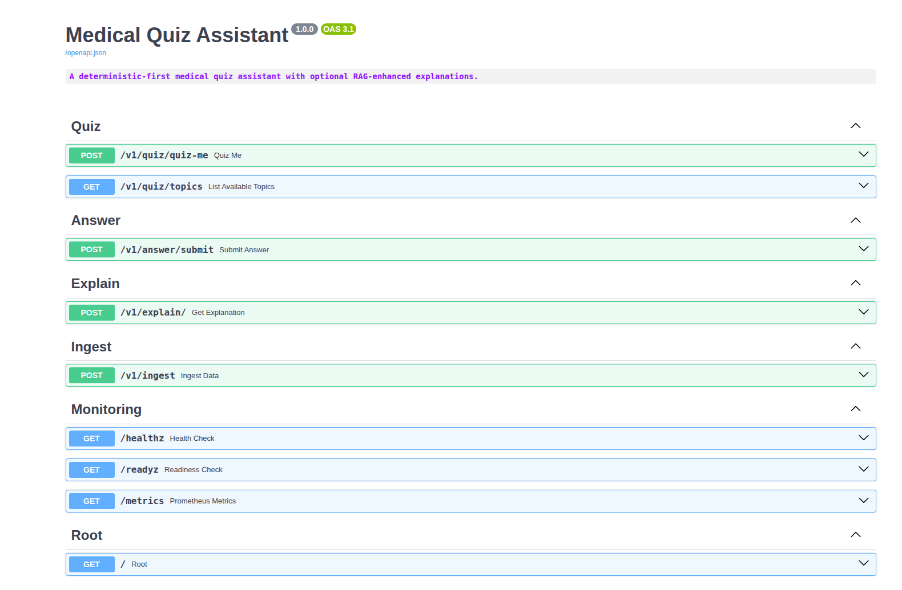

# Medical Quiz Assistant

A deterministic-first medical quiz assistant with RAG-enhanced explanations, built on MedMCQA dataset.

## Overview

This project implements a medical quiz assistant that prioritizes reliability and deterministic behavior while providing optional RAG-enhanced explanations. The system is designed for exam practice with session management, adaptive difficulty, and comprehensive evaluation capabilities.

## API Endpoints



### Key Components

- **FastAPI**: Async web framework for API endpoints
- **ChromaDB**: Vector database for embeddings and similarity search
- **Redis**: Session storage and caching
- **Ollama**: Local LLM inference (Llama 3.x)
- **LangChain**: LLM orchestration and RAG pipelines
- **Prometheus/Grafana**: Monitoring and observability

### Design Principles

1. **Deterministic-first**: Dataset explanations are the default, RAG is opt-in
2. **Session Management**: Persistent user state across quiz sessions
3. **Evaluability**: Built-in evaluation framework for CI/CD
4. **Observability**: Comprehensive logging, metrics, and tracing
5. **Security**: Rate limiting, input validation, and content provenance

## Quick Start

### Prerequisites

- Docker and Docker Compose
- Python 3.11+ (for local development)
- Git

## Guide: Setup, Docker Compose Workflow, and API Testing

This section provides a practical, end-to-end workflow to get productive quickly, with accurate commands and payloads grounded in the current codebase. It assumes you are familiar with Docker, FastAPI, and vector databases (ChromaDB).

### Repo Structure (authoritative paths)

- FastAPI app entrypoint: `src/app/main.py`
- API routers: `src/app/api/` with versioned prefixes registered in `src/app/api/__init__.py`
  - Quiz: `/v1/quiz`
  - Answer: `/v1/answer`
  - Explain: `/v1/explain`
  - Ingest: `/v1/ingest`
- Schemas (request/response DTOs): `src/app/domain/schemas.py`
- Services: `src/app/services/`
- Repositories (Chroma/Redis/etc.): `src/app/repositories/`
- Observability (health, readiness, metrics): integrated via `src/app/api/__init__.py`
- Containerization: `Dockerfile`, `docker-compose.yml`, `docker-compose.simple.yml`

### Environment configuration

1) Copy and edit environment

```bash
cp env.example .env
```

Key variables from `.env.example`:

- `CHROMA_HOST`, `CHROMA_PORT` — vector DB service (in Docker: `chroma:8000`)
- `CHROMA_PERSIST_DIR` — on-disk persistence path for topics catalog and vectors
- `RAG_ENABLED` — toggles RAG integration and LLM usage
- `OLLAMA_HOST`, `OLLAMA_PORT`, `LLM_MODEL` — LLM settings (Ollama)
- `API_HOST`, `API_PORT` — FastAPI server bind and port

Defaults in compose set App to talk to internal services (`redis`, `chroma`, `ollama`).

### Choose your Docker Compose profile

- `docker-compose.yml` — full stack with Redis, ChromaDB, Ollama, Prometheus, Grafana, and hardened settings (healthchecks, resource limits, read-only FS where possible).
- `docker-compose.simple.yml` — lighter stack (App, Redis, Chroma only) with exposed ports, no monitoring.

Pick one according to your needs. Examples below use the full stack, but the API flow is identical with the simple file.

### Build and start services

```bash
# Full stack
docker compose -f docker-compose.yml up -d --build

# Or, simple stack
# docker compose -f docker-compose.simple.yml up -d --build
```

Wait for healthchecks to pass. Then verify health/readiness from the app container:

```bash
curl -sSf http://localhost:8000/healthz | jq .
curl -sSf http://localhost:8000/readyz | jq .
```

If `readyz` reports dependencies unavailable, ensure Chroma and (optionally) Ollama are up.

### Initialize LLM model (if RAG is enabled)

The Ollama container starts empty. Pull the model specified in `.env` (default `llama3.2:1b`). The service is named `ollama` in `docker-compose.yml`.

```bash
docker compose -f docker-compose.yml exec ollama ollama list
docker compose -f docker-compose.yml exec ollama ollama pull llama3.2:1b
```

In code, the app warms up Ollama during startup when `RAG_ENABLED=true` (`lifespan` in `src/app/main.py`). If warm-up fails, RAG features are disabled gracefully.

### Seed the vector store (Ingestion)

The API supports idempotent ingestion of MedMCQA data. See `IngestRequest` in `src/app/domain/schemas.py` for fields.

Endpoint: `POST /v1/ingest`

Example:

```bash
curl -sSf -X POST http://localhost:8000/v1/ingest \
  -H 'Content-Type: application/json' \
  -d '{
        "split": "train",
        "limit": 1000,
        "batch_size": 100
      }' | jq .
```

Successful response (shape):

```json
{
  "questions_processed": 1000,
  "questions_skipped": 0,
  "processing_time_ms": 12345,
  "dataset_version": "<hash>"
}
```

You can inspect discovered topics after ingestion at `GET /v1/quiz/topics` (reads from `CHROMA_PERSIST_DIR`):

```bash
curl -sSf http://localhost:8000/v1/quiz/topics | jq .
```

### Quiz flow (stateless MVP)

Endpoint: `POST /v1/quiz/quiz-me`

Request schema: `QuizMeRequest`

```bash
curl -sSf -X POST http://localhost:8000/v1/quiz/quiz-me \
  -H 'Content-Type: application/json' \
  -d '{
        "command": "Quiz Me",
        "page_size": 1
      }' | jq .
```

Response schema: `QuizMeResponse` with a `questions` array. Each item contains `question_id`, `stem`, and `options` map (`{"A": "...", "B": "...", ...}`), plus optional topic/difficulty.

### Answer submission (deterministic correctness)

Endpoint: `POST /v1/answer/submit`

Request schema: `AnswerRequest`

```bash
curl -sSf -X POST http://localhost:8000/v1/answer/submit \
  -H 'Content-Type: application/json' \
  -d '{
        "question_id": "<from-quiz>",
        "selected_option": "A"
      }' | jq .
```

Response schema: `AnswerResponse` — deterministic evaluation against dataset ground-truth:

```json
{ "correct": true, "correct_option": "A" }
```

### Explanations (dataset-first with optional RAG)

Endpoint: `POST /v1/explain/`

Request schema: `ExplainRequest` with `mode` in `{ "dataset", "rag" }`.

```bash
curl -sSf -X POST http://localhost:8000/v1/explain/ \
  -H 'Content-Type: application/json' \
  -d '{
        "question_id": "<from-quiz>",
        "mode": "dataset"
      }' | jq .
```

If `mode=rag` and `RAG_ENABLED=true`, the service uses Ollama + vector retrieval. Otherwise it falls back to dataset-only with warnings and `source="dataset"`.

Response schema: `ExplainResponse` with `reason_correct`, `reason_incorrect` (array), `key_points`, `citations` (RAG), `confidence`, `source`, `warnings`.

### Monitoring & Ops

- Health: `GET /healthz`
- Readiness: `GET /readyz`
- Prometheus metrics: `GET /metrics`

With the full stack, UIs are available at:

- Grafana: [http://localhost:3000](http://localhost:3000) (default admin/admin; see `docker-compose.yml`)
- Prometheus: [http://localhost:9090](http://localhost:9090)

### Developing and testing locally

The project uses Poetry (see `pyproject.toml`). The Docker image installs the package into a venv and runs `uvicorn` via `python -m`.

Local dev (no Docker):

```bash
poetry install --no-root
poetry run uvicorn app.main:app --host 0.0.0.0 --port 8000
```

```bash
# Locally
poetry run pytest -q

# Inside the app container (full stack compose)
docker compose -f docker-compose.yml exec app pytest -q

# Makefile shortcuts
make test    # poetry run pytest -q
make lint    # ruff + black --check + isort --check + mypy
make fix     # ruff --fix, then format
```

### Troubleshooting

- If `readyz` is failing on Chroma, confirm the service is healthy:

  ```bash
  docker compose -f docker-compose.yml logs -f chroma
  curl -sSf http://localhost:8000/readyz | jq .
  ```

- If RAG explanations return `source="dataset"` despite `RAG_ENABLED=true`, ensure the LLM is warmed up and the model is pulled:

  ```bash
  docker compose -f docker-compose.yml exec ollama ollama list
  docker compose -f docker-compose.yml exec ollama ollama pull llama3.2:1b
  ```

- Ingestion performance: tune `batch_size` and optionally set `limit` in the ingest request to validate the pipeline before full runs.
- Data artifacts: `CHROMA_PERSIST_DIR` contains persisted vectors and `topics.json` consumed by `GET /v1/quiz/topics`.
- Resource limits: the full compose file sets conservative memory/pids limits; adjust if you run large LLMs or higher concurrency.

## Support

For questions and support:

- Check the documentation in `/docs`
